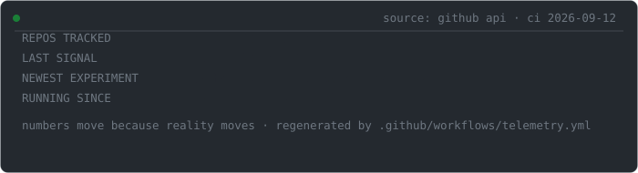

<!-- you read the source before running the binary. the skeptic notes this.
     unlisted commands exist. they are not impossible to find. -->

<p align="center">
  
</p>

<p align="center">
  <sub>you are <b>guest</b> on a machine that verifies before it answers.<br>
  nothing below is asserted. everything is proven, disproven, or marked <code>[unverified]</code>.</sub>
</p>

```text
guest@skeptic-os:~$ whoami

anuj singh — b.e. cse, class of 2026, india.
i build instruments that interrogate other software:
rag pipelines, coding assistants, charts, agents — nothing gets believed for free.
```

```text
guest@skeptic-os:~$ history | tail -n 5

 2025-02   ./first-steps        coursework era (Ap, ap-exp5)
 2025-07   git clone netflix    a rite of passage (netflix-clone)
 2025-12   make instruments     first tools (commitsense, qa-portfolio)
 2026-07   system expansion     yojanasetu · autoinvoice · ghostcoder · causal · devrel
 2026-08   verification era     raglens · orchestrator · one enchanted object
```

<br>

<p align="center">
  
</p>

<sub>the panel above is not decoration. a github action rebuilds it daily from the live api — disbelieve it, then read [.github/workflows/telemetry.yml](https://github.com/anujsingh-cse/anujsingh-cse/blob/main/.github/workflows/telemetry.yml).</sub>

---

```text
guest@skeptic-os:~$ ls -la /processes
```

| PID | PROCESS | STATE | FUNCTION |
|---|---|---|---|
| 001 | [`raglens`](https://github.com/anujsingh-cse/raglens) | ACTIVE | finds the exact chunk that caused the rag answer |
| 002 | [`orchestrator-of-three-cycles`](https://github.com/anujsingh-cse/orchestrator-of-three-cycles) | ACTIVE | measures whether adversarial agent debate beats solo patching |
| 003 | [`GhostCoder`](https://github.com/anujsingh-cse/GhostCoder) | LOCAL | the coding assistant that cross-examines itself |
| 004 | [`causal-inference-toolkit`](https://github.com/anujsingh-cse/causal-inference-toolkit) | STABLE | makes charts prove causality before speaking |
| 005 | [`devrel-agent`](https://github.com/anujsingh-cse/devrel-agent) | DEPLOYED | autonomous contributor: writes the fix, audits it, babysits ci |
| 006 | [`YojanaSetu`](https://github.com/anujsingh-cse/YojanaSetu) | SERVICE | vernacular ai matching citizens to 1,000+ indian govt schemes |
| 007 | [`autoinvoice-ocr`](https://github.com/anujsingh-cse/autoinvoice-ocr) | SERVICE | invoice pdf → structured json → stripe |
| 008 | [`nexus-analytics`](https://github.com/anujsingh-cse/nexus-analytics) | SERVICE | real-time event telemetry, sub-second |
| 009 | [`AgentParliament`](https://github.com/anujsingh-cse/AgentParliament) | CHAMBER | decisions settled by a vote of simulated personas |
| ??? | [`tom-riddle-s-diary`](#forbidden) | CONTAINED | see /forbidden. do not let it learn your name. |

---

### console

<details>
<summary><code>guest@skeptic-os:~$ prove raglens</code></summary>

```text
CLAIM     a rag pipeline can be graded at the level of individual chunks.

EVIDENCE
  attribution(C) = faithfulness(all chunks) − faithfulness(all − {C})
  observed: removing one chunk moved faithfulness 0.42 → 0.89.
  judge: a real llm on nvidia nim. no mocks, no scripted fixtures.
  taxonomy shipped: retrieval_miss · chunk_dominance · generation_ignore.

INSTALL   pip install raglens
SOURCE    github.com/anujsingh-cse/raglens
VERDICT   claim survives cross-examination.
```

</details>

<details>
<summary><code>guest@skeptic-os:~$ run orchestrator --adversarial</code></summary>

```text
QUESTION   do agents that argue merge stronger patches than agents that don't?

METHOD
  coder proposes → adversary attacks → critic rules → human signs off.
  control group: one agent, no debate. every session logged to sqlite, replayable.
  budget: ₹0 — free nvidia nim tier; ollama drops in.

SIDE EFFECT
  every broken patch is archived with full provenance.
  the codebase calls this collection a "failure zoo". the name stuck.

ARTIFACT   124 tests · real bugs from real repositories
SOURCE     github.com/anujsingh-cse/orchestrator-of-three-cycles
STATUS     an experiment, not a product. it reports data, not opinions.
```

</details>

<details>
<summary><code>guest@skeptic-os:~$ audit ghostcoder</code></summary>

```text
SUBJECT    a coding assistant that does not trust itself.

FINDINGS
  no sidebar, no chat — specialist agents whisper inline hints instead.
  a skeptic agent re-reads every suggestion before it reaches you.
  guardrails: rm -rf and DROP DATABASE never make it to the user.
  `ghostcoder replay` reconstructs any session, step by step.
  hardware floor: gtx 1650, 4 gb vram — the same machine this profile runs on.

INSTALL    pip install ghostcoder
SOURCE     github.com/anujsingh-cse/GhostCoder
RESULT     scepticism, packaged: pip-installable.
```

</details>

<details>
<summary><code>guest@skeptic-os:~$ refute correlation</code></summary>

```text
CHARGE     charts keep claiming causation.

DEFENCE
  identify → estimate → refute → sensitivity, all config-driven.
  rosenbaum bounds · e-values · cinelli-hazlett · synthetic control ·
  difference-in-differences · uplift modelling.
  cli + streamlit console + one-command executive html reports.

INSTALL    pip install causal-toolkit
DOCS       anujsingh-cse.github.io/causal-inference-toolkit
RULING     correlation remains innocent until proven structural.
```

</details>

<details>
<summary><code>guest@skeptic-os:~$ trace devrel-agent</code></summary>

```text
TRACE      issue.opened → intent classified → multi-file fix drafted
           → matching tests authored → diff self-audited
           → atomic pr opened → ci watched → failures auto-remediated.

CASCADE    gemini → nvidia nim → github models.
           a dead api never leaves the desk unmanned.

LIVE       devrel-agent-two.vercel.app
SOURCE     github.com/anujsingh-cse/devrel-agent
NOTE       the desk audits its own diffs. habit picked up from the eval floor.
```

</details>

---

## /forbidden

<sub>containment wing. the skeptic patrols here daily.</sub>

```text
guest@skeptic-os:~$ ls /forbidden

SPECIMEN-0    tom-riddle-s-diary     class: enchanted    status: live
READING ROOM  meetily · holehe · watermarks-remover · orca · unsloth
              (checked out, studied, returned with notes. not exhibits.)
```

<details>
<summary><code>guest@skeptic-os:~$ open /forbidden/SPECIMEN-0</code></summary>

```text
CONTAINMENT ENTRY — a diary that talks back

  remembers   what you write        (postgres + chromadb)
  responds    as if it was always listening   (llama-3.3-70b, nvidia nim)
  promises    secrets "that disappear", verbatim, on its landing page
  deployed    against advice — yes, it is live

an engineer of verification built the one machine you must not trust.
this is considered a feature of the collection. handle accordingly.

  → source   github.com/anujsingh-cse/Tom-riddle-s-diary
  → live     tom-riddle-s-diary-sage.vercel.app
```

</details>

---

```text
guest@skeptic-os:~$ tail -n 5 /var/log/skeptic
```

```text
[ok]   "pip install" lines checked against each project's own readme.
[ok]   telemetry panel is generated by ci from the live api — never typed by hand.
[ok]   repo count, last signal, uptime: computed at build time, see workflow file.
[warn] claim "class of 2026" is time-bounded. re-verification due july 2026.
[warn] the enchanted object remains enchanted. flagged weekly. no fix planned.
```

<details>
<summary><code>guest@skeptic-os:~$ sudo trust me</code></summary>

```text
sudo: trust must be computed, not granted.
this incident has been logged — twice. the skeptic duplicates everything.
```

</details>

<details>
<summary><code>guest@skeptic-os:~$ refute anuj</code></summary>

```text
grounds for doubt, offered without prompting:

  · zero stars across the fleet at build time — adoption: unproven
  · several experiments are young; replication is invited
  · response latency scales with examination season

refutation declined. the subject agreed with you first.
```

</details>

<details>
<summary><code>guest@skeptic-os:~$ make resume --fast</code></summary>

<br>

**Anuj Singh** — B.E. Computer Science, class of 2026, India.

Builds evaluation and verification tooling for AI systems, and the systems themselves.
Installable today:

- **raglens** — chunk-level RAG diagnostics: counterfactual attribution, conflict detection, failure taxonomy; NVIDIA NIM-native judge. `pip install raglens`
- **orchestrator-of-three-cycles** — research harness: does adversarial multi-agent debate beat solo patching? 124 tests, replayable audit log.
- **GhostCoder** — local-first AI pair programmer with self-validation, session replay, safety guardrails. `pip install ghostcoder`
- **causal-inference-toolkit** — DoWhy/EconML wrapper: refutation, sensitivity analysis, quasi-experiments, uplift. `pip install causal-toolkit` + docs site.
- **devrel-agent** — autonomous GitHub contributor: triage → fix → tests → PR → CI remediation. Deployed.

Stack, plainly: Python · TypeScript · LLM evaluation · multi-agent systems · causal inference · OCR pipelines · Ollama on a 4 GB GPU · Next.js · FastAPI · Stripe.

Graduates 2026. Intercom: open an issue on any process.

</details>

<br>

```text
guest@skeptic-os:~$ exit

logout. the machine stays on.
```

<p align="center">
  <sub>skeptic-os v1.0 — two images on this page; one of them is built daily by ci from live data.<br>
  the other is a boot sequence for a computer that exists only here.</sub>
</p>
